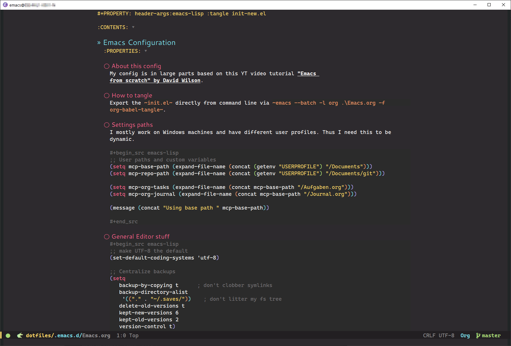

# Dotfiles and Playbooks #

These are my dotfiles. It is always work in progress und may be unstable to use. 

Most of these settings are used inside of an Ubuntu 20.04 WSL2 within my Windows 10.

Notice that my Emacs config is based on an `Emacs.org` file that you need to generate the `init.el` file from using the later command:

```bash
emacs --batch -l org Emacs.org -f org-babel-tangle
```

You can read about the [details of my config here](./.emacs.d/Emacs.org).

This will create an `init-new.el` that you can use to symlink or overwrite your actual `init.el` inside the `.emacs.d` directory.

## Setup via Ansible ##

This part has been removed from this repo and is now a separate one.

Check it out at [BitBucket](https://bitbucket.org/gengor/ansible-linux-pc/)

## Screenshots ##




## License ##

My stuff is licensed under GPL 3.

The wallpaper is only in this repo so the scripts are working. I got it from
Wallheaven and Alphacoders and credit goes to the respective creator.

- [Wallpaper: Wallheaven](https://wallhaven.cc/w/mdzkm1)
- [Alt-Wallpaper: Alphacoders](https://wall.alphacoders.com/big.php?i=1010054)
- [Flat Remix Wallpaper](https://www.opendesktop.org/p/1277548/)
