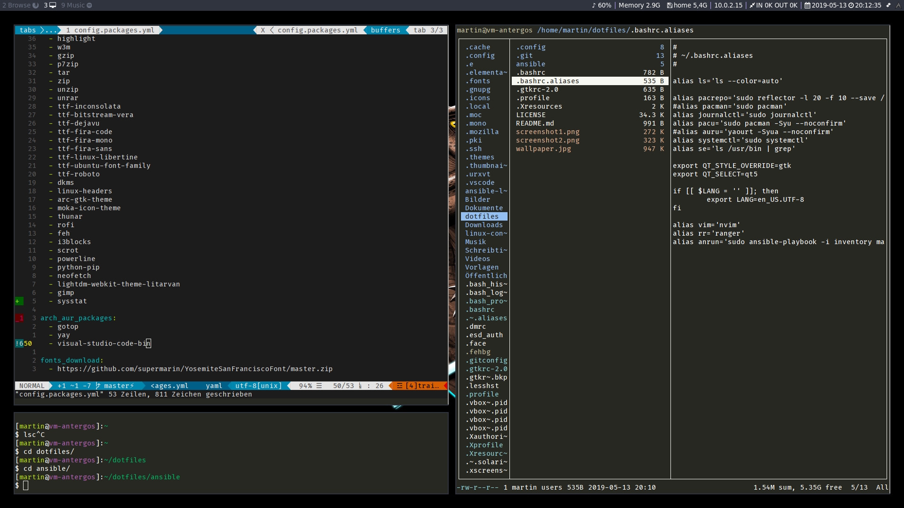

# Dotfiles and Playbooks #

These are my dotfiles together with some Ansible to make the installation
simpler. It is currently still work in progress und may be unstable to use. As
of now they are only inside my Antergos (Arch OS) Linux VM, running a i3-wm.

## Prerequisits ##

These packages must be installed manually:

- ansible

If you didn't use Antergos with i3 setup, you will probably need:

- i3-gaps or i3-wm
- X-Org (and stuff)

To run the Ansible playbooks enter:

```bash
sudo ansible-playbook -i inventory main.yml
```

Furthermore you can use tags to run only certain tasks:

- fonts
- aursetup
- dotfiles

## Know Bugs ##

To install the AUR packages this playbook installs a plugin to root's home
directory. However in the first run it will spawn an error, as the plugin will
not be loaded while the play is running.

The Workaround is simple: just run the playbook again, as that time the module
is already present in root's `.ansible` folder.

**Notice:**

The playbook will overwrite your configs with symlinks for the dotfiles. Check
the `config.dotfiles.yml` for the required files. If you do not want this at all
 set the matching parameters in the `config.settings.yml` to `no` or reduce the
 list wo that is in your interest.

Some configs need to be run as your regular user. Since I did not get a stable
"auto-reading" from the system, it will ask you with a prompt.




## License ##

My stuff is licensed under GPL 3.

The wallpaper is only in this repo so the scripts are working. I got it from
Wallheaven and Alphacoders and credit goes to the respective creator.

- [Wallpaper: Wallheaven](https://wallhaven.cc/w/mdzkm1)
- [Alt-Wallpaper: Alphacoders](https://wall.alphacoders.com/big.php?i=1010054)
- [Flat Remix Wallpaper](https://www.opendesktop.org/p/1277548/)
